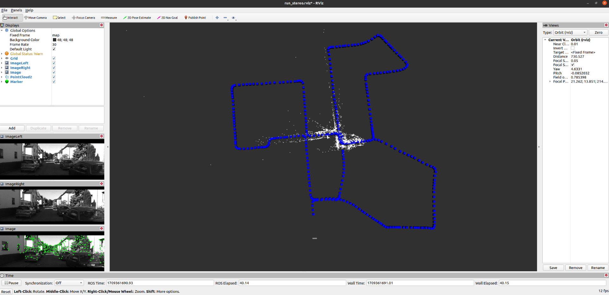
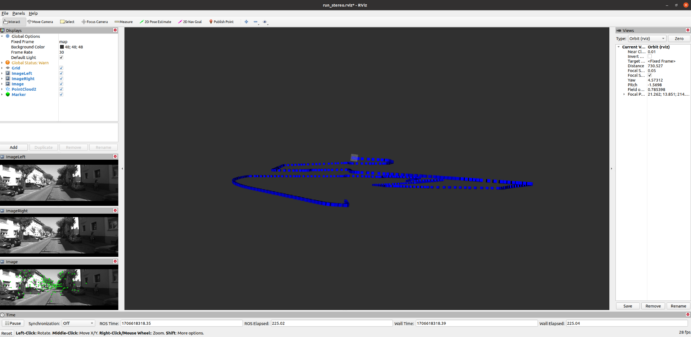
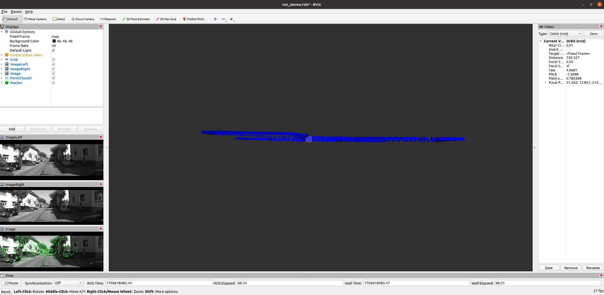
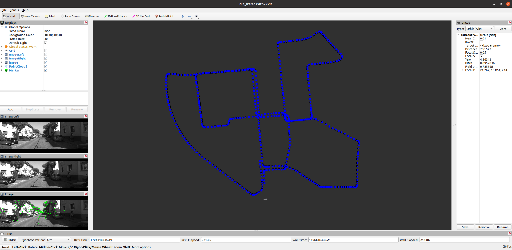
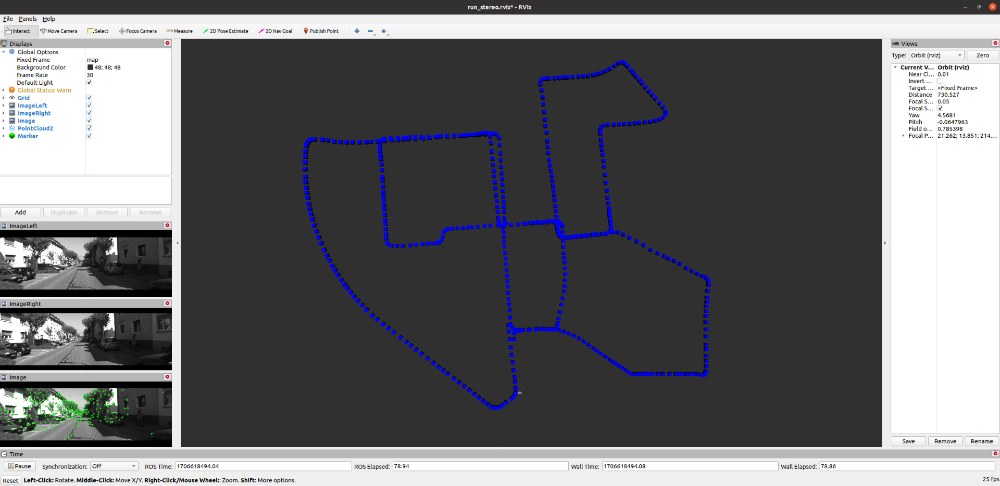

# Stereo SLAM

## 概述

简易双目光流SLAM算法的实现，基于[SLAM十四讲 ch13](https://github.com/gaoxiang12/slambook2)，学习及存档使用。部分改动如下：

- 整合重构代码结构，修改参数获取方式及程序入口
- 移除Pangolin等库，改为使用ROS Rviz发表轨迹和点云
- 添加仅对位姿的优化函数规避Z轴偏移问题(Rviz显示发现kitti00数据轨迹在Z轴偏移)

## 文件结构

```
├── CMakeLists.txt				//CMakeLists
├── cmake_modules				//cmake modules
│   ├── FindCSparse.cmake
│   └── FindG2O.cmake
├── config
│   ├── params.yaml				// params config(dataset_dir...)
│   └── run_stereo.rviz			// rviz config
├── include
│   └── stereo_slam				// include
│       ├── camera.h
│       ├── comm_include.h
│       ├── g2o_types.h
│       ├── map.h
│       ├── odometry.h
│       ├── optimization.h
│       ├── struct_def.h
│       └── viewer.h
├── package.xml
├── run_stereo.launch		// ros launch cofig
└── src
    ├── run_stereo.cpp		// system entrance
    └── stereo_slam			// src
        ├── camera.cpp
        ├── map.cpp
        ├── odometry.cpp
        ├── optimization.cpp
        ├── struct_def.cpp
        └── viewer.cpp
```

## 依赖库

- **Ubuntu20.04 + ROS Noetic** 
- **OpenCV 4.2** (Noetic自带)
- **Eigen 3.3.7** ([link](https://eigen.tuxfamily.org/index.php?title=Main_Page))
- **FMT 10.2.1** ([link](https://github.com/fmtlib/fmt.git))
- **Sophus 1.22.10**([link](https://github.com/strasdat/Sophus))
- **G20 9b41a4e**([link](https://github.com/RainerKuemmerle/g2o/tree/9b41a4ea5ade8e1250b9c1b279f3a9c098811b5a))

## 安装

```bash
1.Ubuntu20.04+ROS Noetic
# 自行安装

2.OpenCV(version: 4.2.0）
# 安装ROS Noetic，后系统已存在opencv4.2.0，查看版本：
pkg-config --modversion opencv4

3.安装Eigen(version: 3.3.7)
sudo apt-get install libeigen3-dev

4.安装fmt(version: 10.2.1, Sophus依赖库)
git clone https://github.com/fmtlib/fmt.git
cd fmt && mkdir build && cd build
cmake ..  && make
sudo make install

5.安装Sophus(version: 1.22.10)
git clone https://github.com/strasdat/Sophus.git
cd Sophus && mkdir build && cd build
cmake .. && make
sudo make install

6.安装G2O(version: 9b41a4e)
# 自行下载slambook2/3rdparty中较旧版本的g2o，新版本不兼容
# (https://github.com/RainerKuemmerle/g2o/tree/9b41a4ea5ade8e1250b9c1b279f3a9c098811b5a)
cd g2o && mkdir build && cd build
cmake .. && make -4
sudo make install

7.下载测试数据及克隆代码
# 下载kitti00数据集
mkdir -p ~/ws_stereo_slam/src/
cd ~/ws_stereo_slam/src/
git clone https://github.com/mazhuang1124/stereo_slam.git

8.编译及运行
# 修改config/params.yaml文件的dataset_dir参数
cd ~/ws_stereo_slam
catkin_make
source ./devel/setup.bash
roslaunch stereo_slam run_stereo.launch
# 若报错error while loading shared libraries: libg2o_core.so: cannot open shared object file
# 执行”sudo gedit /etc/ld.so.conf“ 编辑该文件，添加“/usr/local/lib"后保存，并在控制台执行”sudo ldconfig“
```

## 效果演示

### 运行状态



### 轨迹对比

<table>
    <tr>
        <td ><center>图1 OptimizePoseMap_01 </center></td>
        <td ><center>图2 OptimizePoseOnly_01</center></td>
    </tr>
    <tr>
        <td ><center>图3 OptimizePoseMap_02 </center></td>
        <td ><center>图4 OptimizePoseOnly_02</center></td>
    </tr>
<table>
    
## Acknowledgement

[SLAM十四讲](https://github.com/gaoxiang12/slambook2)
